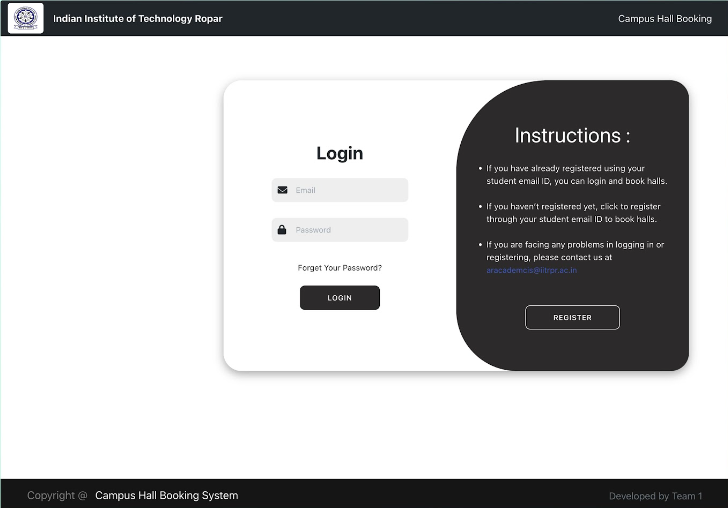
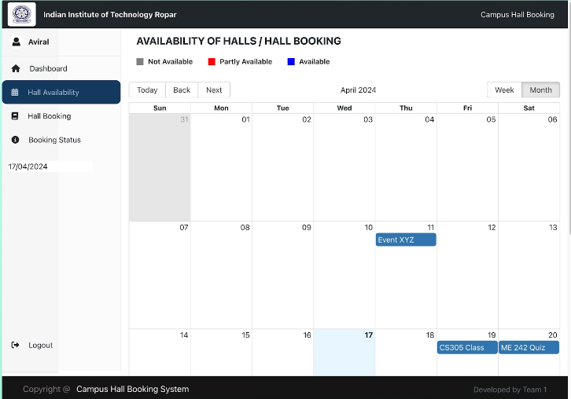
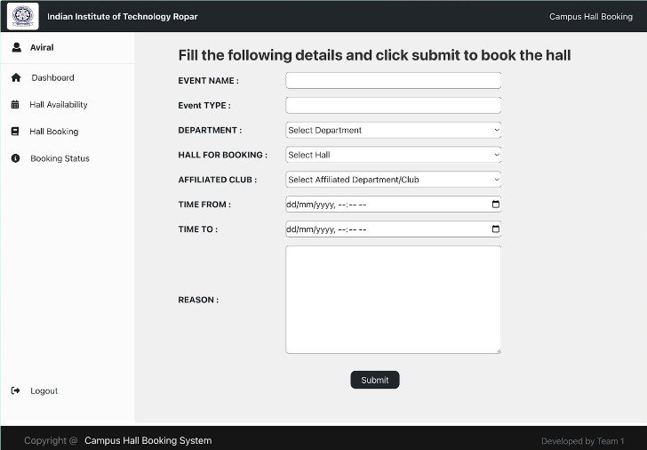
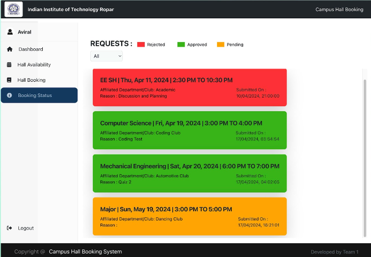
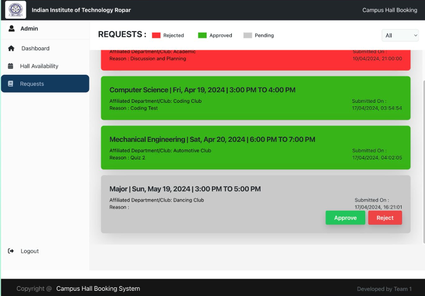

# Hall Booking Management System

## Description

Hall Booking Management app built with react as a team project. 
 - Online Hall Booking 
 - Booking Approval and Rejection 
 - Student Dashboard
 - Admin Dashboard 


## Table of Contents

1. [Installation](#installation)
2. [Usage](#usage)
3. [Technologies Used](#technologies-used)
4. [Screenshots](#screenshots)


## Installation

To install and set up the project locally follow the below commands:

```bash
# Clone the repository
git clone https://github.com/Keshav7802//Hall-Booking-Management.git

# Navigate to the project directory
cd Hall-Booking-Management

# Install dependencies
npm install
```

## Usage

To run the project (both client and server)

```bash
# Start the development server
npm run dev
```


## Technologies Used

The technologies, frameworks, and libraries used in the project include:

- Frontend:
  - React
  - HTML
  - CSS 
  - Tailwind

- Backend:
  - Node.js
  - Express.js
  - MongoDB


## Screenshots

- Login Page 
    

- Hall Availability Page
    

- Hall Booking Form 
    

- Booking status page
    

- Admin Request Page
    

---
